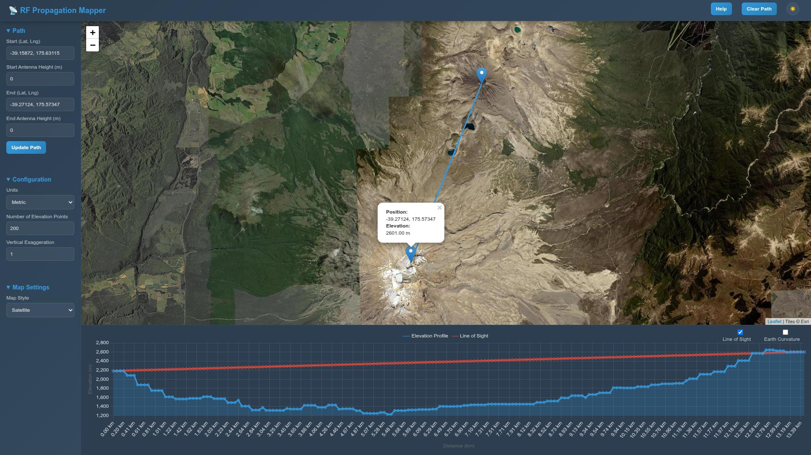

# RF-propagation

# RF Propagation Mapper

A web-based tool for visualizing RF propagation paths and elevation profiles.

## Features

*   **Interactive Map:** Click on the map to define a start and end point for the propagation path.
*   **Elevation Profile:** View a detailed elevation profile along the selected path.
*   **Line of Sight:** Toggle a line-of-sight overlay on the elevation profile to visualize the direct path between the two points.
*   **Antenna Heights:** Adjust the antenna heights at the start and end points to see how they affect the line of sight.
*   **Customizable:** Configure units, map styles, and other settings to suit your needs.
*   **Modern UI:** A clean and modern user interface with day and night modes.

## Demo

Use it live at [rfp.wavevector.co.nz](rfp.wavevector.co.nz)

## Usage

1.  Click on the map to add a start and end point for the path.
2.  Alternatively, you can manually enter the coordinates for the start and end points in the sidebar and click "Update Path".
3.  The elevation profile will be displayed in the chart below the map.
4.  You can adjust the antenna heights for the start and end points to see how it affects the line of sight.
5.  Use the options in the sidebar to configure the units, map style, and other settings.

## Configuration

*   **Path:** Manually enter the coordinates for the start and end points, and the antenna heights.
*   **Configuration:** Adjust the units, number of elevation points, and vertical exaggeration.
*   **Map Settings:** Choose from a variety of map styles.

## Technologies Used

*   HTML
*   CSS
*   JavaScript
*   [Leaflet](https://leafletjs.com/)
*   [Chart.js](https://www.chartjs.org/)
*   [Open-Elevation API](https://open-elevation.com/)
